# SO-ARM101 Open-Source 6-Axis Robotic Arm User Manual

## 1. LeRobot Introduction

**LeRobot** is an open-source robot learning framework developed by **Hugging Face**. It is mainly used for robot behavior cloning and reinforcement learning. The framework provides a unified platform for researchers and developers to train, deploy, and evaluate robot policies. **SO-ARM101** is a commonly used open-source robotic arm in the LeRobot ecosystem and supports leader/follower teleoperation. The operator can control the follower arm with the leader arm to complete tasks and collect motion trajectory data for training the robot to autonomously perform grasping, carrying, and related operations. The robotic arm has a lightweight structure and is easy to assemble, making it suitable as entry-level hardware for LeRobot learning and experiments.

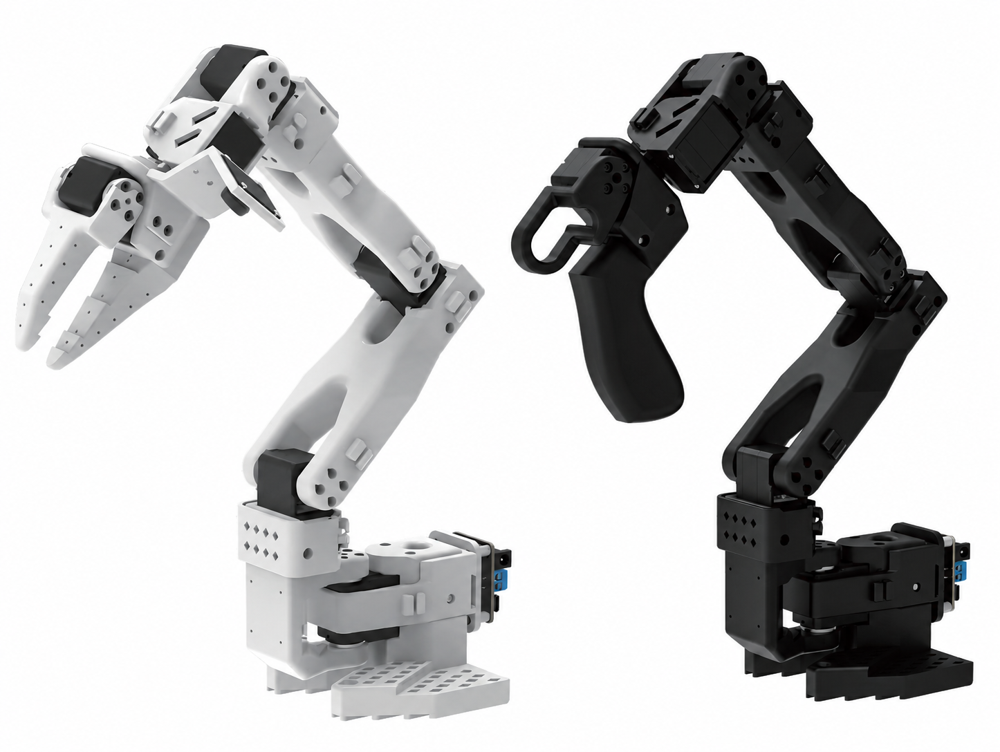

### 1.1 Core Features

1. **Multimodal Data Support**: Supports multiple types of sensor data, including vision, touch, and audio.
2. **Flexible Policy Architecture**: Supports multiple learning paradigms, including behavior cloning and reinforcement learning.
3. **Extensive Robot Support**: Compatible with multiple robot platforms and hardware configurations.
4. **Cloud Training Support**: Supports distributed training and cloud deployment.
5. **Easy Extensibility**: Uses a modular design that makes it easy to add new robot types and algorithms.

### 1.2 Technical Architecture

**LeRobot** is built on **PyTorch** and uses a modern deep learning technology stack:

1. **Data Processing**: Efficient data loading and preprocessing pipelines.
2. **Model Training**: Supports multiple neural network architectures and training strategies.
3. **Real-Time Inference**: Uses an optimized inference engine that supports real-time robot control.
4. **Visualization Tools**: Provides extensive data visualization and training monitoring tools.

### 1.3 Ecosystem

**LeRobot** is deeply integrated with the **Hugging Face** ecosystem:

1. **Model Sharing**: Share trained models through **Hugging Face Hub**.
2. **Dataset Management**: Provides unified dataset storage and version control.
3. **Community Support**: Provides an active open-source community and extensive documentation resources.
4. **Continuous Updates**: Releases new features and performance optimizations regularly.

### 1.4 Robotic Arm Introduction

**SO-ARM101** is a desktop robotic arm system for robot learning, teleoperation control, and motion data collection. The system usually consists of a **leader arm** and a **follower arm**. The two arms have similar structures but different functional roles. The leader arm is mainly used for manual operation and motion demonstration. The operator drags the leader arm to complete specified actions, and the system collects the position information of each joint in real time. The follower arm works as the execution end and moves synchronously according to the motion data transmitted from the leader arm, enabling leader/follower control.

#### 1.4.1 Leader Arm Introduction

The leader arm of SO-ARM101 is also called the **teleoperation arm**. It is mainly used for manual demonstration and motion collection. The operator can directly drag the leader arm by hand to perform actions such as grasping, moving, and placing. The system reads the position data of each joint in real time and sends the data to the follower arm for execution, or saves it as the dataset required for later model training.

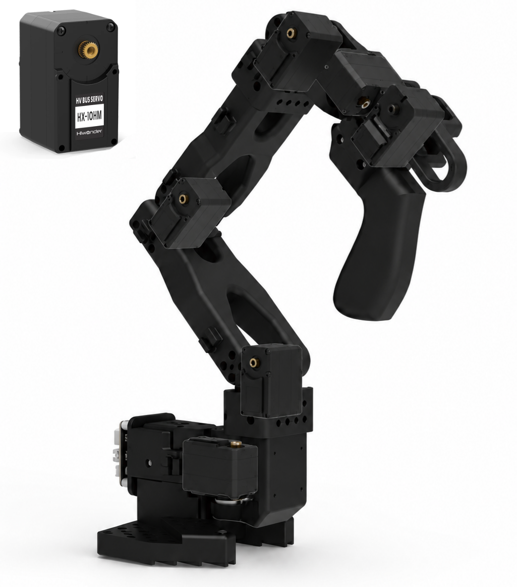

The leader arm uses the **HX-10HM servo** as the joint drive unit, with a reduction ratio of **1:147**. Compared with high-ratio servos, the HX-10HM has a lower reduction ratio and relatively lower joint rotation resistance. Manual dragging is smoother, which makes it suitable for manual operation and pose collection. Since the leader arm mainly serves as the motion input device and does not need to carry objects directly, it focuses more on operating feel, response speed, and smooth motion collection.

| Servo model | Rotation speed | Stall torque | Reduction ratio | Voltage range |
| -------- | --------------------- | ----------------- | ------ | -------- |
| HX-10HM  | 0.10 sec/60° @ 11.1V | 10 kg·cm @ 11.1V | 1:147  | 9-12.6V |

#### 1.4.2 Follower Arm Introduction

The follower arm of SO-ARM101 is also called the **execution arm**. It is mainly responsible for executing motion commands transmitted from the leader arm. In teleoperation mode, when the operator moves the leader arm, the follower arm follows the joint pose of the leader arm in real time and moves synchronously. During model inference or policy execution, the follower arm can automatically complete tasks such as grasping, moving, and placing according to the trained control policy.

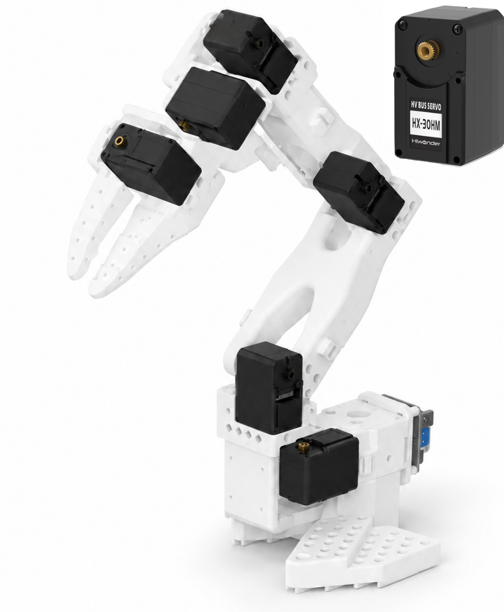

The follower arm uses the **HX-30HM servo** as the joint drive unit, with a reduction ratio of **1:345**. Compared with the HX-10HM servo used by the leader arm, the HX-30HM has a higher reduction ratio and can provide greater output torque under the same motor conditions. The joint has stronger load capacity and resistance to external force, making it more suitable for motion control and object grasping at the execution end.

| Servo model | Rotation speed | Stall torque | Reduction ratio | Voltage range |
| -------- | --------------------- | ----------------- | ------ | -------- |
| HX-30HM  | 0.19 sec/60° @ 11.1V | 30 kg·cm @ 11.1V | 1:345  | 9-12.6V |

### 1.5 Recommended Learning Path

For first-time use, do not start data collection or model training directly. Complete environment configuration and robotic arm assembly first, then confirm ports, calibrate the leader and follower arms, and run teleoperation without vision. After the robotic arm moves stably, connect the cameras and begin data collection. Use the same camera configuration and task scene for training and inference to make troubleshooting easier and improve stability.

## 2. Hardware and Environment Preparation

### 2.1 Hardware List

- DIY Kit (Unassembled)

> [!NOTE]
>
> **This kit does not include 3D-printed parts. Print the robotic arm brackets separately. The 3D printing files can be found in the appendix. Use the following printer parameters as a reference:**
>
> * **Material: PLA**
> * **Layer height: 0.20mm**
> * **Infill density: 15%**

| No. | Name | Image | Qty | No. | Name | Image | Qty |
| :--: | :-- | :--: | :--: | :--: | :-- | :--: | :--: |
| 1 | HX-30HM bus servo | 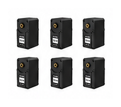 | 6 | 2 | HX-10HM bus servo | 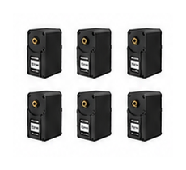 | 6 |
| 3 | BusLinker V3.0 servo debugging board | 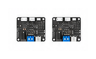 | 2 | 4 | 12V 5A adapter (DC5.5*2.5) | 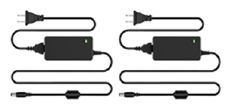 | 2 |
| 5 | USB hub( 4 ports, 1000mm) | 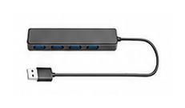 | 1 | 6 | 2-inch G-clamp | 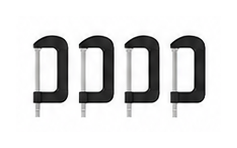 | 4 |
| 7 | Type-C cable (1000mm) | 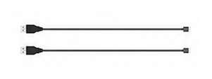 | 2 | 8 | Camera mount | 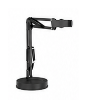 | 1 |
| 9 | Servo cable (100mm) | 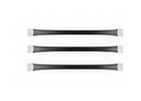 | 3 | 10 | Servo cable (160mm) | 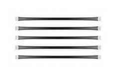 | 5 |
| 11 | Servo cable (200mm) | 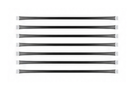 | 7 | 12 | Metal main servo horn | 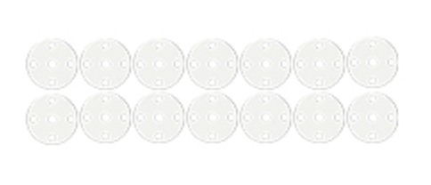 | 14 |
| 13 | Metal assistant servo horn | 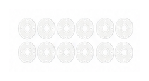 | 12 | 14 | Cable tie (3*150mm) | 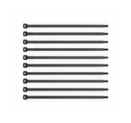 | 10 |
| 15 | Screwdriver | 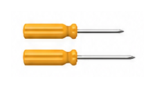 | 2 | 16 | M2.5*10 double-pass nylon standoff |  | 10 |
| 17 | M3*10 countersunk screw | 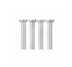 | 4 | 18 | M3* 5*7 self-tapping screw with washer | 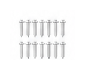 | 14 |
| 19 | M3*6 screw | 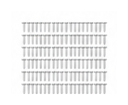 | 120 | 20 | M2*6 self-tapping screw | 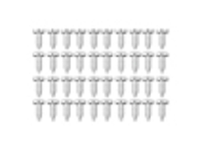 | 40 |
| 21 | M2.5*4 screw | 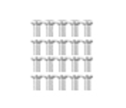 | 20 | 22 | M2*28 half-thread flat-tail self-tapping screw | 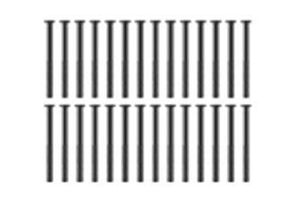 | 28 |
| 23 | M3 nut | 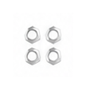 | 4 |  |  |  |  |

- Starter Kit (Pre-Assembled)

| No. | Name | Image | Qty | No. | Name | Image | Qty |
| :--: | :-- | :--: | :--: | :--: | :-- | :--: | :--: |
| 1 | Leader arm | 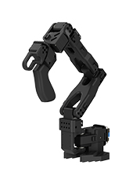 | 1 | 2 | Follower arm | 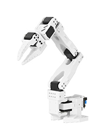 | 1 |
| 3 | 12V 5A adapter (DC5.5*2.5) | 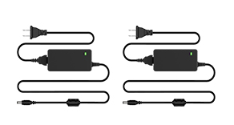 | 2 | 4 | USB hub (4 ports, 1000mm) | 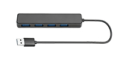 | 1 |
| 5 | 2-inch G-clamp | 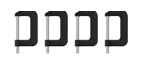 | 4 | 6 | Type-C cable (1000mm) | 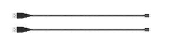 | 2 |
| 7 | Servo cable (100mm) | 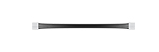 | 1 | 8 | Servo cable (160mm) | 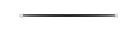 | 1 |
| 9 | Servo cable (200mm) | 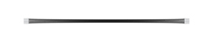 | 1 | 10 | Metal main servo horn x2 + assistant servo horn x2 | 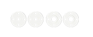 | 1 set |
| 11 | Cable tie (3*150mm) | 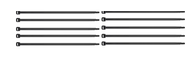 | 10 | 12 | Screwdriver | 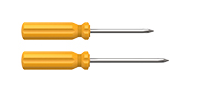 | 2 |
| 13 | Accessory pack | 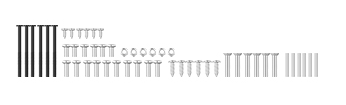 | 1 |  |  |  |  |

- Standard Kit (Pre-Assembled)

| No. | Name | Image | Qty | No. | Name | Image | Qty |
| :--: | :-- | :--: | :--: | :--: | :-- | :--: | :--: |
| 1 | Leader arm |  | 1 | 2 | Follower arm |  | 1 |
| 3 | 12V 5A adapter (DC5.5*2.5) |  | 2 | 4 | USB hub (4 ports, 1000mm) |  | 1 |
| 5 | 2-inch G-clamp |  | 4 | 6 | Type-C cable (1000mm) |  | 2 |
| 7 | Servo cable (100mm) |  | 1 | 8 | Servo cable (160mm) |  | 1 |
| 9 | Servo cable (200mm) |  | 1 | 10 | Metal main servo horn x2 + assistant servo horn x2 |  | 1 set |
| 11 | Cable tie (3x150mm) |  | 10 | 12 | Screwdriver |  | 2 |
| 13 | Accessory pack |  | 1 | 14 | 300K Pixel HD camera | 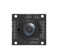 | 1 |
| 15 | Camera bracket | 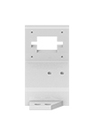 | 1 | 16 | USB data cable (1000mm) | 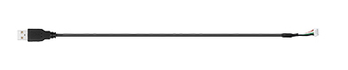 | 1 |

- Advanced Kit (Pre-Assembled)

| No. | Name | Image | Qty | No. | Name | Image | Qty |
| :--: | :-- | :--: | :--: | :--: | :-- | :--: | :--: |
| 1 | Leader arm |  | 1 | 2 | Follower arm |  | 1 |
| 3 | 12V 5A adapter (DC5.5*2.5) |  | 2 | 4 | USB hub (4 ports, 1000mm) |  | 1 |
| 5 | 2-inch G-clamp |  | 4 | 6 | Type-C cable (1000mm) |  | 2 |
| 7 | Servo cable (100mm) |  | 1 | 8 | Servo cable (160mm) |  | 1 |
| 9 | Servo cable (200mm) |  | 1 | 10 | Metal main servo horn x2 + assistant servo horn x2 |  | 1 set |
| 11 | Cable tie (3*150mm) |  | 10 | 12 | Screwdriver |  | 2 |
| 13 | Accessory pack |  | 1 | 14 | Camera mount | 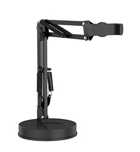 | 1 |
| 15 | 300K Pixel HD camera | 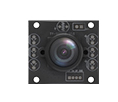 | 1 | 16 | 2MP HD wide-angle camera | 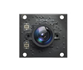 | 1 |
| 17 | Camera bracket |  | 1 | 18 | Camera bracket | 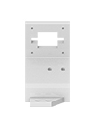 | 1 |
| 19 | USB cable (1000mm) | 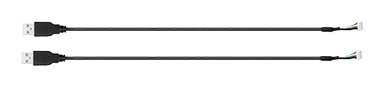 | 2 |  |  |  |  |


### 2.2 Environment Configuration

> [!NOTE]
>
> **If environment or software issues occur, check the FAQ at the end of this document first. If the issue remains unresolved, contact the support team.**

Environment configuration consists of two parts: install Miniconda first, then create the `lerobot` virtual environment and install project dependencies. Windows and Ubuntu use different entry points, but subsequent commands must be run in the same `lerobot` environment.

#### 2.2.1 Install Miniconda

* **Windows System Installation**

1. Download the **Miniconda** installer.

Method 1: Find **Miniconda3-py311_25.7.0-2-Windows-x86_64.exe** from the [Miniconda Official Installer](https://repo.anaconda.com/miniconda/) page and download the installer to the computer.

Method 2: Download the installer from [2.Software Tools & Source Code\Software Tools](https://drive.google.com/drive/folders/1q19iGq56PZwog_Nexgw7mtCH1Nac1kFi?usp=sharing).

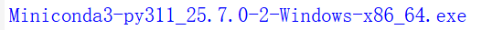


The Miniconda installer usually takes 1 to 10 minutes to download, depending on network bandwidth.

2. Install **Miniconda**.

Locate the downloaded **Miniconda** installer and double-click it to install.

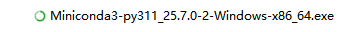

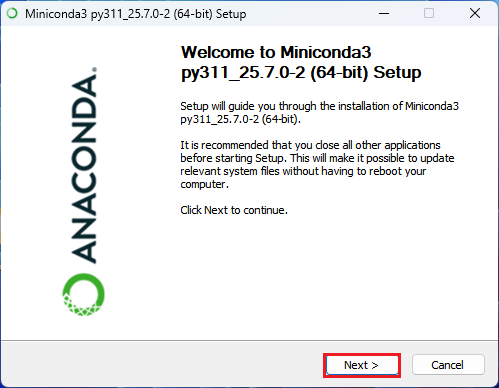

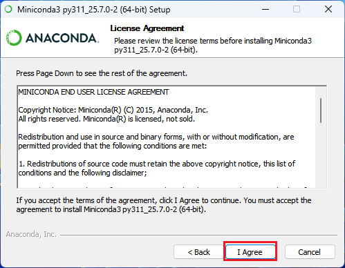


**Check all options at the bottom. Otherwise, environment configuration issues may occur.**


* **Ubuntu System Installation**

1. Download the **Miniconda** package.

Press **Ctrl+Alt+T** to open the terminal, then enter the command to download the **Miniconda** package. The download usually takes 1 to 10 minutes.

```bash
wget https://repo.anaconda.com/miniconda/Miniconda3-py311_25.7.0-2-Linux-x86_64.sh
```


2. Install **Miniconda**.

Enter the command to install **Miniconda**.

```bash
sh Miniconda3-py311_25.7.0-2-Linux-x86_64.sh
```


Press **Enter** to continue.


Enter **yes**, then press **Enter** to continue.


The default installation directory is `/home/ubuntu/miniconda3`. Press **Enter** directly if the installation directory does not need to be changed. To change the installation directory, enter the target path and press **Enter**.


Enter **yes**, then press **Enter** to complete the installation.


After installation, close the terminal and reopen it. The interface shown below will appear.


To prevent the **Miniconda** **Python** environment from being enabled by default, add one command line to the `.bashrc` file.

Enter the command to open the `.bashrc` file.

```bash
gedit .bashrc
```


Locate the conda initialize block and add the following command below it. After adding it, press **Ctrl+S** to save and close the file. Reopen the terminal for the change to take effect.

```bash
conda config --set auto_activate false 
```


#### 2.2.2 Configure the Virtual Environment

* **Configure the Virtual Environment on Windows**

1. Open the terminal.

Press **Win+R**, enter **cmd**, and open the terminal.


2. Create the virtual environment.

Enter the command and press **Enter** to create the virtual environment and install the **ffmpeg** package. Version 7.1.1 is recommended and supports **libsvtav1 encoding**.

```cmd
conda create -n lerobot python=3.10.18 ffmpeg=7.1.1 -c conda-forge
```

> [!NOTE]
>
> **Creating the environment for the first time usually takes about 5 to 15 minutes. Conda dependency resolution may take 1 to 5 minutes, followed by downloading and installing Python, ffmpeg, and other packages. When the network is slow, a mirror source is used for the first time, or disk performance is low, the wait may extend to about 20 minutes. Do not close the terminal during installation.**


When the prompt shown below appears, press **y**, then press **Enter** to continue.


After creation, enter the command to view the created virtual environments.

```cmd
conda env list
```


3. Enter the virtual environment.

```cmd
conda activate lerobot
```


4. Download the code repository.

**SO-ARM101 open-source 6-axis robotic arm** project package path: [**2.Software Tools & Source Code\Source Code\lerobot.zip**](https://drive.google.com/drive/folders/1znOVSfGEBI5AMCkcNf1wbgCxmS5_Zfm5?usp=sharing)

Open `lerobot.zip` and extract it to the desktop.


5. Install dependency packages.

Enter the **lerobot** directory, install the **lerobot** dependency package, and specify the servo-related driver.

```cmd
cd Desktop\lerobot
pip install -e ".[feetech]"
```

Installing the servo driver and project dependencies for the first time usually takes about 3 to 10 minutes. If the download is slow, check the network connection first and do not close the terminal before installation is complete.


* **Configure the Virtual Environment on Ubuntu**

1. Create the virtual environment.

Press **Ctrl+Alt+T** to open the terminal. Enter the command and press **Enter** to create the virtual environment and install the **ffmpeg** package. Version 7.1.1 is recommended and supports **libsvtav1 encoding**.

```bash
conda create -n lerobot python=3.10.18 ffmpeg=7.1.1 -c conda-forge
```

> [!NOTE]
>
> **Creating the environment for the first time usually takes about 5 to 15 minutes. If dependency resolution stays active for a long time, wait patiently for several minutes. When the network is slow or packages need to be downloaded again, the overall process may take about 20 minutes.**

When the prompt shown below appears, press **y**, then press **Enter** to continue.


After creation, enter the command to view the created virtual environments.

```bash
conda env list
```


2. Enter the virtual environment.

```bash
conda activate lerobot
```


3. Download the code repository.

**SO-ARM101 open-source 6-axis robotic arm** project package path: [**Software Tools & Source Code\Source Code\lerobot.zip**](https://drive.google.com/drive/folders/1znOVSfGEBI5AMCkcNf1wbgCxmS5_Zfm5?usp=sharing)

Copy **lerobot.zip** to the `/home/ubuntu` directory in the **Ubuntu** system, then use the `unzip` tool to extract it.

```bash
unzip lerobot.zip
```


Enter the command in the terminal to view the files.

```bash
ls
```


4. Install dependency packages.

Enter the **lerobot** directory, install the **lerobot** dependency package, and specify the servo-related driver.

```bash
cd lerobot
pip install -e ".[feetech]"
```

Installing project dependencies for the first time usually takes about 3 to 10 minutes. The wait mainly depends on network speed and whether related Python caches already exist locally.


## 3. Robotic Arm Assembly

The following steps are basically the same on **Ubuntu** and **Windows**. This section uses **Windows** as an example.

Complete assembly and wiring in the recommended order: mechanical structure, camera, servo cable, USB cable, and power supply. Before adjusting servo cables, disassembling brackets, or confirming ports, disconnect the power supply first to avoid abnormal servo behavior or port recognition errors caused by hot plugging.

> [!NOTE]
>
> **On Ubuntu, run the following commands if USB port access must be granted:**
>
> **sudo chmod 666 /dev/ttyACM0**
> **sudo chmod 666 /dev/ttyACM1**

### 3.1 Hardware Assembly

Refer to the related video path: [1. Tutorials\Video Tutorials\3.2 Hardware Assembly](https://drive.google.com/drive/folders/1bohRZgWKNnFfbfGrtFSwXgSWHF2A1B5c?usp=sharing)

### 3.2 Camera Installation

Refer to the related video path: [1. Tutorials\Video Tutorials\3.3 Camera Installation Tutorial](https://drive.google.com/drive/folders/1bohRZgWKNnFfbfGrtFSwXgSWHF2A1B5c?usp=sharing)

### 3.3 Circuit Connection

Refer to the related video path: [1. Tutorials\Video Tutorials\3.4 Circuit Connection Tutorial](https://drive.google.com/drive/folders/1bohRZgWKNnFfbfGrtFSwXgSWHF2A1B5c?usp=sharing)

### 3.4 Check the Port Number

> [!NOTE]
>
> **`COM22` and `COM24` in this document are example port numbers. Use the port numbers shown in Device Manager as the actual values. If the actual ports are different, replace the port parameters in subsequent commands accordingly and make sure the leader arm and follower arm ports are not reversed.**

1. Connect the follower arm first, open **Device Manager**, and check the port number.


2. Connect the leader arm, then check the newly added port number.


3. Set fixed port numbers for easier future use. Right-click the COM icon, click **Properties**, then open **Port Settings** -> **Advanced**.


4. Click the port number and set the leader arm port to **COM22** and the follower arm port to **COM24**. If COM22 is displayed as "in use", the port is occupied or has been configured before.


5. Set the leader arm and follower arm port numbers to 22 and 24 respectively. The setup is successful when it appears as shown below.


### 3.5 Servo ID Setting (Optional)

> [!NOTE]
>
> - **This section applies to DIY kit operators. Pre-assembled kits do not require ID setting.**
> - **Refer to the related videos:  [Leader Arm ID Setting](https://youtu.be/3n-g9WUL9KQ?si=W_5kb71w6jbzi2aq) and [Follower Arm ID Setting](https://youtu.be/alwucevpiCQ?si=HZnn6fNdBLOA-M6W)**

The servo names from top to bottom of the robotic arm are `gripper`, `wrist_roll`, `wrist_flex`, `elbow_flex`, `shoulder_lift`, and `shoulder_pan`, corresponding to `ID6` through `ID1`.


---

> [!NOTE]
>
> **When setting servo IDs, keep only one servo connected to the control board and unplug the other daisy-chained signal cables. Otherwise, multiple servos may be written with the same ID, causing abnormal calibration and control later.**

#### 3.5.1 Leader Arm ID Setting

Press **Win+R**, enter **cmd**, and open the terminal.


Enter the command to enter the virtual environment.

```cmd
conda activate lerobot
```


Use the `cd` command to enter the project folder, then enter the leader arm command to set the `ID`.

```cmd
cd Desktop\lerobot
lerobot-setup-motors --teleop.type=so101_leader --teleop.port=COM22
```


Each time a servo name prompt appears, make sure only the servo with the corresponding `ID` is connected, then press **Enter** to set it automatically. When the next servo name appears, the previous servo has been set successfully. Follow the prompts to plug and unplug the servo cable, then press **Enter** again for the next servo.

> [!NOTE]
>
> **Clearly mark the configured ID numbers to avoid confusion during assembly. Each servo must be installed on the corresponding joint.**


#### 3.5.2 Follower Arm ID Setting

The follower arm ID setting steps are the same as those for the leader arm. After entering the project folder, enter the follower arm ID setting command. Refer to [Leader Arm ID Setting](#351-leader-arm-id-setting).

```cmd
lerobot-setup-motors --robot.type=so101_follower --robot.port=COM24
```


## 4. Robotic Arm Control

Control the robotic arm in the recommended order: calibration, teleoperation without vision, and teleoperation with vision. Calibration establishes the joint position correspondence between the leader and follower arms. Run teleoperation without vision first to confirm that the motion direction and port settings are correct, then connect the cameras. This avoids troubleshooting multiple issues at the same time during vision-based collection.

### 4.1 Robotic Arm Calibration

> [!NOTE]
>
> **Before calibration and teleoperation, make sure there are no obstacles around the robotic arm. If an exception occurs during operation, press `Ctrl+C` in the terminal to exit the program.**

Calibrate the robotic arm to ensure that the leader and follower arms maintain the same joint position values when they are in the same physical position.

#### 4.1.1 Leader Arm Calibration

Before calibration, rotate all joints of the leader arm to the calibration initial position shown below.


Enter the calibration command to start calibration.

```cmd
lerobot-calibrate --teleop.type=so101_leader --teleop.port=COM22 --teleop.id=my_awesome_leader_arm
```


If calibration has not been performed before, press **Enter** to start calibration. If recalibration is required, enter **c** first, then press **Enter**.


During calibration, manually rotate each joint of the robotic arm. Refer to the follower arm calibration video for detailed operation.

#### 4.1.2 Follower Arm Calibration

Before calibration, rotate all joints of the follower arm to the calibration initial position shown below.


The follower arm calibration method is the same as the leader arm. After entering the project folder, enter the follower arm calibration command. Refer to [Leader Arm Calibration](#411-leader-arm-calibration).

```cmd
lerobot-calibrate --robot.type=so101_follower --robot.port=COM24 --robot.id=my_awesome_follower_arm
```


### 4.2 Teleoperation Without Vision

Enter the command to start robotic arm teleoperation.

```cmd
python -m lerobot.teleoperate --robot.type=so101_follower --robot.port=COM24 --robot.id=my_awesome_follower_arm --teleop.type=so101_leader --teleop.port=COM22 --teleop.id=my_awesome_leader_arm
```


When the prompt shown below appears, press **Enter** to continue.


When the interface shown below appears, control the follower arm through the leader arm.


Press **Ctrl+C** to terminate the program.

### 4.3 Teleoperation With Vision

Connect the USB cables of both cameras to the computer.

---

> [!NOTE]
>
> **1. If a docking station is used, do not connect both camera USB cables to the docking station.**
>
> **2. The fixed environment camera must capture the full motion range of the follower arm.**

---

Enter the command to find the camera `ID` values and check whether images from both cameras can be captured.

```cmd
lerobot-find-cameras opencv
```

Camera detection usually takes about 10 to 30 seconds. The program opens each recognizable camera in sequence and saves test images. If many cameras are connected, USB devices were just connected for the first time, or the computer performance is low, the wait may extend to about 1 minute.


After the command finishes, captured images are saved to `outputs\captured_images`.


Differentiate the camera `ID` values by file name: `opencv_0` corresponds to `index_or_path: 0`, and `opencv_1` corresponds to `index_or_path: 1`.

> [!NOTE]
>
> **Camera `ID` values are not permanently fixed. After unplugging and reconnecting USB devices, changing USB ports, or changing computers, the order of `opencv_0` and `opencv_1` may change. Confirm the camera images again before running teleoperation with vision or data collection.**

Run the command to start teleoperation with the vision display.

```cmd
python -m lerobot.teleoperate --robot.type=so101_follower --robot.port=COM24 --robot.id=my_awesome_follower_arm --robot.cameras="{ fixed: {type: opencv, index_or_path: 1, width: 640, height: 480, fps: 30}, handeye: {type: opencv, index_or_path: 0, width: 640, height: 480, fps: 30}}" --teleop.type=so101_leader --teleop.port=COM22 --teleop.id=my_awesome_leader_arm --display_data=true
```


---

> [!NOTE]
>
> **`fixed` is the fixed environment camera, and `handeye` is the gripper camera.**

---

When the prompt shown below appears, press **Enter** to continue.


When the leader arm controls the follower arm, the system returns the camera feeds at the same time. To close the program, press **Ctrl+C** in the terminal.


## 5. Data Acquisition

After teleoperation verification is complete, begin collecting training data. Data quality directly affects later model training results. Before each recording round, confirm the camera view, lighting, target object position, and robotic arm initial position.

Data acquisition steps:

1. Initialize the robot and sensors.
2. Start the teleoperation interface.
3. Control the robot to complete the task.
4. The system records all sensor data and control commands synchronously.
5. The data is saved in the standard LeRobot dataset format.
6. Optional real-time quality monitoring and visualization.

> [!NOTE]
>
> **Data acquisition time reference: **Starting the collection program and initializing the robotic arm and cameras usually takes 20 to 60 seconds. The total duration of each data round consists of the demonstration action, environment reset, and data saving. The saving stage usually takes several seconds to several tens of seconds. For 20 rounds of data, reserve at least 30 to 90 minutes and prepare enough desktop space and stable lighting before starting.

Run the command for data acquisition. `${HF_USER}` can be changed as needed, but the account name must be in English. This example collects 20 episodes. To collect more episodes, change `20` in `dataset.num_episodes=20` to the target count.

> [!NOTE]
>
> **1. Before data acquisition, practice controlling the robotic arm until it can complete the grasping action smoothly. This avoids inaccurate data caused by improper operation.**
>
> **2. In the command, `${HF_USER}` can be replaced directly with an English account name. For example, change `--dataset.repo_id=${HF_USER}/demo` to `--dataset.repo_id=Admin/demo`.**

```cmd
python -m lerobot.record --robot.type=so101_follower --robot.port=COM24 --robot.id=my_awesome_follower_arm --robot.cameras="{ handeye: {type: opencv, index_or_path: 0, width: 640, height: 480, fps: 30}, front: {type: opencv, index_or_path: 1, width: 640, height: 480, fps: 30}}" --teleop.type=so101_leader --teleop.port=COM22 --teleop.id=my_awesome_leader_arm --display_data=true --dataset.repo_id=${HF_USER}/demo --dataset.num_episodes=20 --dataset.single_task="Grab the screwdriver" --dataset.push_to_hub=false
```

After the command starts, robot connection and camera initialization usually take about 20 to 60 seconds. Data encoding and saving after each recording round usually take several seconds to several tens of seconds. The wait increases when more cameras or higher resolutions are used. Do not close the terminal or unplug USB devices before the save progress is complete.


When the prompt shown below appears, press **Enter** to continue to the next step.


When the prompt shown below appears, data recording has started. Control the leader arm so that the follower arm grasps the target object and places it at the target location.


> [!NOTE]
>
> **During recording, keep the environment relatively static except for the robotic arm. For example, keep the camera view focused on robotic arm motion and prevent arms, people, or other irrelevant content from entering the frame.**

After the action is complete, press **→** to continue. When the prompt shown below appears, reset the environment.


After the environment has been reset, press **→** to save the data. When the progress bar shown below reaches 100%, the data has been saved. To discard the current round of data, press **←** to re-record it. The current round will not be saved.


After one recording round ends, the system waits for the next recording. When the indicator shown below appears, the next round of data recording has started.


This example collects 20 rounds of data. To improve data diversity, do not place the target object in exactly the same position for every round.


When **Recording episode 19** is displayed, the twentieth recording round has started. After the recording is complete, **Stop recording** is printed, indicating that data acquisition is complete. Press **Esc** to terminate the program.


Data is saved by default in `C:\Users\Admin\.cache\huggingface\lerobot`.

> [!NOTE]
>
> **The actual cache path changes with the Windows account name and `dataset.repo_id`. If the computer account name is not `Admin`, find the dataset in `.cache\huggingface\lerobot` under the corresponding account directory.**


## 6. Dataset Training

Local training is recommended on a computer with a discrete GPU and a CUDA environment. Before training the dataset, confirm that the dataset has been collected and can be found in the default cache directory.

### 6.1 Local Training

The dataset is saved by default in `C:\Users\Admin\.cache\huggingface\lerobot`.


Press **Win+X**, then click **Terminal (Admin)** to open the command-line terminal with administrator privileges.


Enter the command to activate the virtual environment and enter the **lerobot** working directory.

```cmd
conda activate lerobot
cd .\Desktop\lerobot\
```


Before training, enter the command to install the dependencies required for training.

```cmd
python -m pip install -e ".[training]" -i https://pypi.tuna.tsinghua.edu.cn/simple
```

Installing training dependencies for the first time usually takes about 5 to 20 minutes. Several Python packages will be downloaded during installation. Wait patiently if the network is slow. Repeated installation usually uses the local cache first and takes less time.

> [!NOTE]
>
> * **Local training on a computer without a discrete GPU is not recommended.**
> * **The following steps require a computer with a discrete GPU.**
> * **Before installing PyTorch, enter `nvidia-smi` in the terminal to confirm that the computer can recognize the NVIDIA GPU and driver correctly.**

Enter the command to install the PyTorch version corresponding to **CUDA 11.8**.

```cmd
pip install torch==2.7.1 torchvision==0.22.1 torchaudio==2.7.1 --index-url https://download.pytorch.org/whl/cu118
```

The PyTorch installation package is large. The first download and installation usually take about 5 to 20 minutes, and may take longer on a slow network. After installation, run `nvidia-smi` or import `torch` in Python to check whether the GPU environment is working properly.


The model training parameter configuration file is located at `src\lerobot\configs\train.py`, as shown below. Adjust it as needed.


Parameter description:

- `dataset`: Dataset configuration object that defines the dataset used for training.
- `env`: Environment configuration object used to define parameters for the robot simulation or real environment, optional.
- `policy`: Pretrained model configuration that defines the architecture and parameters of the policy network, optional.
- `output_dir`: Training output directory path used to store model checkpoints, logs, and other files. Training again with the same path overwrites existing content unless `resume` is enabled.
- `job_name`: Task name used to identify the current training task, optional.
- `resume`: Whether to resume training from a checkpoint. When set to `True`, make sure at least one checkpoint file exists in `output_dir`.
- `seed`: Random seed, default `1000`, used to control randomness in model initialization, dataset shuffling, and evaluation environments for reproducible experiments.
- `num_workers`: Number of data loader worker processes, default `4`, which affects data loading speed.
- `batch_size`: Batch size, default `8`, indicating the number of samples processed in each iteration.
- `steps`: Total number of training steps, default `100,000`.
- `eval_freq`: Evaluation frequency, default every `20,000` steps, used to periodically evaluate model performance on the validation set.
- `log_freq`: Logging frequency, default every `200` steps, used to control the interval for recording training metrics.
- `save_checkpoint`: Whether to save training checkpoints, default `True`.
- `save_freq`: Checkpoint saving frequency, default every `20,000` steps. A checkpoint is also saved after the final training step.
- `use_policy_training_preset`: Whether to use the policy training preset configuration, default `True`.
- `optimizer`: Optimizer configuration object that defines parameters such as learning rate and weight decay, optional.
- `scheduler`: Learning rate scheduler configuration that defines the learning rate decay strategy, optional.
- `eval`: Evaluation configuration object that contains detailed evaluation settings.
- `wandb`: W&B configuration object used for experiment tracking and visualization.

Enter the command to start training. After the program starts, it reads the dataset and initializes the model. Training logs usually begin to appear after waiting 1 to 5 minutes.

```cmd
python src/lerobot/scripts/train.py --dataset.repo_id=${HF_USER}/demo --policy.type=act --output_dir=outputs/train/act_so101_test --job_name=act_so101_test --policy.device=cuda --wandb.enable=false  --policy.push_to_hub=false
```

> [!NOTE]
>
> **Training time reference:** With an RTX4090 and the default `100000` training steps, training usually takes about 2 to 3 hours. Training time increases significantly when GPU performance is lower, the dataset is larger, or background programs occupy GPU memory. Keep the computer powered on during training, prevent sleep mode, and reserve enough disk space for checkpoints.


After training is complete, a `train` folder is generated under `lerobot/outputs`. The specific path is `C:/Users/Admin/Desktop/lerobot/outputs/train`.


## 7. Model Testing

The inference process of the **SO-ARM101 open-source 6-axis robotic arm** uses a data-driven approach so the robot can imitate human behavior. It treats complex robot control as a supervised learning task and relies on a trained model for inference. The model fuses environmental information, mainly visual observations, with natural-language instructions and maps them directly to specific robot control actions. In essence, this is imitation learning based on behavior cloning. The goal is to let the robot learn from human demonstration data and gain end-to-end inference capability from perception to action so it can complete a specific task.

This chapter uses the `lerobot.record` command for inference because the command not only loads the model from `policy.path`, but also handles camera reading, follower arm control, and evaluation data saving in a unified way. Before inference, confirm that the model, camera configuration, and scene placement are consistent with training data collection. A change in any of these items may reduce motion performance.

Inference deployment steps:

1. Load the trained policy model.
2. Initialize the physical robot and its sensors.
3. Establish the mapping from sensor data to policy input.
4. Establish the mapping from policy output to robot control commands.
5. Execute policy inference and robot control in the control loop.
6. Optional real-time visualization and monitoring.

### 7.1 Real-Time Inference Testing

Press **Win+R**, enter **cmd**, and open the terminal.


Enter the command to enter the virtual environment and switch to the project directory.

```cmd
conda activate lerobot
cd Desktop\lerobot
```


Enter the command to start inference. During the first startup, the program loads the model, connects to the follower arm, and initializes the cameras. This usually takes about 20 to 60 seconds. Initialization may take longer if more cameras are connected or USB devices were just reconnected.

> [!NOTE]
>
> **1. In `outputs/train/act_so101_test/checkpoints/100000/pretrained_model`, `100000` is the configured `steps` parameter, which is the total number of training steps. To use the model saved from the final training checkpoint, change `"100000"` to `"last"`.**
>
> **2. Before inference, confirm that the camera `ID` values, leader/follower arm port numbers, and training model path all match the current computer environment. If USB devices have been reconnected, find the port numbers and camera `ID` values again first.**
>
> **3. `dataset.episode_time_s=60` indicates that a single inference or evaluation lasts 60 seconds. Increase this parameter for longer tasks, or decrease it for short tests.**

```cmd
python -m lerobot.record --robot.type=so101_follower --robot.port=COM24 --robot.id=my_awesome_follower_arm --robot.cameras="{ handeye: {type: opencv, index_or_path: 0, width: 640, height: 480, fps: 30}, front: {type: opencv, index_or_path: 1, width: 640, height: 480, fps: 30}}" --display_data=true --dataset.repo_id=${HF_USER}/eval_so101 --dataset.single_task="Grab the screwdriver" --policy.path=outputs/train/act_so101_test/checkpoints/100000/pretrained_model --dataset.episode_time_s=60
```

When the prompt shown below appears, press **Enter** to continue.


When the indicator shown below appears, the robotic arm has started inference.


After inference starts, the duration of a single round is determined by `dataset.episode_time_s`. The example value is `60`, which means each round lasts about 60 seconds. After inference ends, saving data usually takes several seconds to several tens of seconds. Wait until the save completion prompt appears before entering the next round or exiting the program.

When the robotic arm reaches the inference time, it stops moving. Press **→** to save the inference data. When the indicator shown below appears, this inference round has ended and the program automatically starts the next round of inference.


To exit inference mode, press **Ctrl+C** in the terminal.

### 7.2 Common Issues During Inference

**Issue 1: Error when running the inference command for the second time**

**Description:** During inference, the first run completes normally, but the program reports an error when the inference command is executed again. The system detects that the local path `C:/Users/Admin/Desktop/lerobot/${HF_USER}/eval_so101` already exists. Because this directory was not cleaned or rebuilt after the previous run, the new inference task cannot initialize the evaluation environment, causing a path conflict error and interrupting execution.

**Root cause:** The evaluation output directory `eval_so101` does not use run isolation or automatic cleanup. The program does not overwrite an existing folder by default. When the command is run for the second time, the old evaluation result directory still exists, causing directory creation to fail or process initialization to become abnormal.

**Suggestion:** After inference is complete, manually clean the `eval_so101` folder before running inference again.


**Issue 2: Distribution Shift and Poor Generalization**

**Description:** The model performs well in states seen during training, such as object position, lighting, and background. However, performance drops significantly when it encounters slightly different situations, also called out-of-distribution data. For example, if training uses a white desktop but inference uses a wooden desktop, the robotic arm may fail to recognize the object accurately.

**Root cause:** The model learns the state distribution in the training data rather than a deep understanding of the physical world. It is closer to memorizing training data than truly understanding the task.

**Suggestion:** During data collection, cover more object positions, lighting conditions, backgrounds, and placement angles. During inference, keep the environment as consistent as possible with the collection environment.


**Issue 3: Compounding Error**

**Description:** This is a classic issue in behavior cloning. At each inference step, the model may produce small motion errors. Because inference is usually executed in open loop and does not correct itself in real time according to the result, the next input state may already be affected by the previous erroneous action and move farther from the ideal state in the training data. As errors accumulate step by step, the robotic arm may deviate from the correct trajectory and eventually fail the task.

**Root cause:** Errors accumulate during inference. As the errors continue to grow, the robotic arm gradually deviates from the intended trajectory.

**Suggestion:** During data recording, keep movements stable and paths clear, and reduce hesitation and repeated adjustments. Start each round from a standardized initial position whenever possible to avoid recording abnormal actions into the dataset.


**Issue 4: Overfitting to Demonstration Style**

**Description:** The model may learn not only the necessary actions for completing the task, but also the demonstrator's personal habits or specific style, such as an inefficient grasping posture. When the environment changes, this fixed style may no longer be effective.

**Root cause:** The goal of the model is to imitate the demonstration data as closely as possible, but the demonstration data may contain non-optimal or task-irrelevant behavior patterns.

**Suggestion:** During data collection, use stable, concise, and repeatable actions whenever possible. If multiple people collect data, unify the operation standard to reduce style differences.

## 8. FAQ

This chapter summarizes the most common issues during use. When an error occurs, first return to the corresponding chapter according to the issue type and check the environment, ports, calibration, cameras, or model path. Avoid repeatedly running control commands before confirming the basic configuration.

### 8.1 Terminal Does Not Recognize `conda`

The possible cause is that Miniconda was not added to the system environment variables correctly, or the terminal was not reopened after installation. Close the current terminal and reopen it first, then run `conda env list`. If `conda` is still not recognized, confirm whether the environment variable options were selected during Miniconda installation.

### 8.2 Robotic Arm Port Cannot Be Connected

Check whether the USB cables of the leader arm and follower arm are connected securely, then open **Device Manager** to confirm whether the port numbers are still COM22 and COM24. If the port numbers have changed, update the port parameters in the commands before running them. On Ubuntu, also confirm whether ports such as `/dev/ttyACM0` and `/dev/ttyACM1` have been granted access.

### 8.3 Robotic Arm Direction or Position Is Inconsistent During Teleoperation

This issue is usually related to calibration status. Move the leader and follower arms back to the initial position, then run the calibration process for the leader arm and the follower arm separately. If calibration has already been performed before, enter `c` as prompted before continuing with recalibration.

### 8.4 Camera Image Is Incorrect or Camera Cannot Be Found

Run the camera search command first and confirm whether `opencv_0` and `opencv_1` both generate images correctly. If the image order is not as expected, adjust `index_or_path` in the command. If a docking station is used, connect at least one camera directly to a computer USB port and do not connect both cameras to the same docking station at the same time. On Ubuntu, also confirm whether ports such as `/dev/video*` have been granted access.

### 8.5 Training Result Is Unstable

Check data quality first: whether the target object position varies enough, whether lighting is stable, whether arms or people appear in the image, and whether each round of motion is complete. When the number of data rounds is too small, the model is more likely to overfit. Increase the number of collection rounds and keep the actions standardized.

### 8.6 Model Path Cannot Be Found During Inference

Confirm whether `outputs/train/act_so101_test/checkpoints/100000/pretrained_model` exists in the training output directory. The value `100000` must match the `steps` setting used during training. If a different number of training steps was used, change the checkpoint path in the inference command to the actual generated directory.


## 9. Bimanual Coordinated Operation (Extension)

The bimanual system consists of two leader arms and two follower arms. The leader arms are responsible for manual demonstration, and the follower arms execute motions synchronously. During vision-based collection, training, and inference, the left and right follower arms work together to complete bimanual tasks. Complete the bimanual test in the recommended order: confirm ports, set IDs, calibrate, run teleoperation without vision, run teleoperation with vision, collect data, train, and run inference.


### 9.1 Port and Environment Preparation

For virtual environment creation, project installation, and entering the project directory, refer to [2.2 Environment Configuration](#22-environment-configuration). For finding and fixing the port numbers of the four robotic arms, refer to [3.4 Check the Port Number](#34-check-the-port-number).

To keep bimanual configuration parameter names consistent, this chapter maps **Robotic Arm 1** to `left_arm` in commands and **Robotic Arm 2** to `right_arm` in commands. If the actual installation direction is reversed, swap the left and right port parameters at the same time. Do not cross the correspondence between leader arms and follower arms.

| Robotic arm | Name in command | Example port number | Role |
| :-- | :-- | :--: | :-- |
| Leader arm 1 | `teleop.left_arm_port` | `COM22` | Left-side demonstration input |
| Leader arm 2 | `teleop.right_arm_port` | `COM23` | Right-side demonstration input |
| Follower arm 1 | `robot.left_arm_port` | `COM24` | Left-side execution output |
| Follower arm 2 | `robot.right_arm_port` | `COM25` | Right-side execution output |

> [!NOTE]
>
> **The following commands use `COM22` for leader arm 1, `COM23` for leader arm 2, `COM24` for follower arm 1, and `COM25` for follower arm 2 as examples. Use the port numbers shown in Device Manager as the actual values. After a port changes, replace the `left_arm_port`, `right_arm_port`, and `port` parameters in subsequent commands accordingly.**

```cmd
conda activate lerobot
cd Desktop\lerobot
```

Before executing any command in this chapter, confirm that all four USB cables are securely connected and that the terminal has entered the `lerobot` project directory. If USB devices are reconnected or the computer port is changed, confirm the port numbers again first.

### 9.2 Servo ID Setting (Optional)

For the DIY kit servo ID setting method, single-servo connection requirement, and assembly correspondence, refer to [3.5 Servo ID Setting (Optional)](#35-servo-id-setting-optional). Pre-assembled robotic arms do not need to run the commands in this section.

The IDs of a bimanual system must still be set one robotic arm at a time. Do not connect all four robotic arms and set them at once. Use the `so101_leader` type for leader arms and the `so101_follower` type for follower arms. After each command is complete, switch to the next robotic arm.

**Left and right leader arm ID setting:**

```cmd
lerobot-setup-motors --teleop.type=so101_leader --teleop.port=COM22
lerobot-setup-motors --teleop.type=so101_leader --teleop.port=COM23
```

**Left and right follower arm ID setting:**

```cmd
lerobot-setup-motors --robot.type=so101_follower --robot.port=COM24
lerobot-setup-motors --robot.type=so101_follower --robot.port=COM25
```

### 9.3 Bimanual Calibration

For the initial position before calibration, entering `c` during recalibration, and rotating joints, refer to [4.1 Robotic Arm Calibration](#41-robotic-arm-calibration).

The bimanual calibration commands guide calibration of two robotic arms in sequence. Complete calibration of the left and right leader arms first, then complete calibration of the left and right follower arms. During calibration, leader arm 1 and follower arm 1, as well as leader arm 2 and follower arm 2, should keep the same joint correspondence. The calibration files are associated with the `bimanual_leader` and `bimanual_follower` identifiers in the commands, and these identifiers should remain unchanged during later teleoperation, collection, and inference.

**Left and right leader arm calibration:**

```cmd
lerobot-calibrate --teleop.type=bi_so101_leader --teleop.left_arm_port=COM22 --teleop.right_arm_port=COM23 --teleop.id=bimanual_leader
```

**Left and right follower arm calibration:**

```cmd
lerobot-calibrate --robot.type=bi_so101_follower --robot.left_arm_port=COM24 --robot.right_arm_port=COM25 --robot.id=bimanual_follower
```

### 9.4 Bimanual Teleoperation Without Vision

For starting, confirming, and exiting teleoperation, refer to [4.2 Teleoperation Without Vision](#42-teleoperation-without-vision).

Teleoperation without vision is the recommended check after the bimanual system is powered on for the first time. It does not depend on camera configuration, making it easier to confirm whether leader/follower directions, ports, and calibration results are correct. After running the command, leader arm 1 controls follower arm 1, and leader arm 2 controls follower arm 2. If direction, amplitude, or initial position is abnormal, exit the program and check calibration again instead of continuing to data collection.

```cmd
python -m lerobot.teleoperate --robot.type=bi_so101_follower --robot.left_arm_port=COM24 --robot.right_arm_port=COM25 --robot.id=bimanual_follower --teleop.type=bi_so101_leader --teleop.left_arm_port=COM22 --teleop.right_arm_port=COM23 --teleop.id=bimanual_leader
```

### 9.5 Bimanual Teleoperation With Vision

For camera connection, image confirmation, and exiting, refer to [4.3 Teleoperation With Vision](#43-teleoperation-with-vision). The bimanual system uses three cameras by default: left wrist, right wrist, and environment. If a fourth side-view camera is used, use the four-camera command version.

In the bimanual vision configuration, wrist cameras observe details near their respective grippers, while the environment camera observes the overall cooperation area of the two follower arms. Run the camera search command first. Confirm whether each `index_or_path` matches the table below according to the generated images, then select the corresponding teleoperation command.

| Camera name | Recommended view | Example `index_or_path` | Three cameras | Four cameras |
| :-- | :-- | :--: | :--: | :--: |
| `left_wrist` | Gripper of follower arm 1 | `0` | Yes | Yes |
| `right_wrist` | Gripper of follower arm 2 | `1` | Yes | Yes |
| `front` | Environment view covering the bimanual workspace | `2` | Yes | Yes |
| `side` | Supplementary side or overhead environment view | `3` |  | Yes |

```cmd
lerobot-find-cameras opencv
```

**Three-camera version:**

```cmd
python -m lerobot.teleoperate --robot.type=bi_so101_follower --robot.left_arm_port=COM24 --robot.right_arm_port=COM25 --robot.id=bimanual_follower --robot.cameras="{ left_wrist: {type: opencv, index_or_path: 0, width: 640, height: 480, fps: 30}, right_wrist: {type: opencv, index_or_path: 1, width: 640, height: 480, fps: 30}, front: {type: opencv, index_or_path: 2, width: 640, height: 480, fps: 30}}" --teleop.type=bi_so101_leader --teleop.left_arm_port=COM22 --teleop.right_arm_port=COM23 --teleop.id=bimanual_leader --display_data=true
```

**Four-camera version:**

```cmd
python -m lerobot.teleoperate --robot.type=bi_so101_follower --robot.left_arm_port=COM24 --robot.right_arm_port=COM25 --robot.id=bimanual_follower --robot.cameras="{ left_wrist: {type: opencv, index_or_path: 0, width: 640, height: 480, fps: 30}, right_wrist: {type: opencv, index_or_path: 1, width: 640, height: 480, fps: 30}, front: {type: opencv, index_or_path: 2, width: 640, height: 480, fps: 30}, side: {type: opencv, index_or_path: 3, width: 640, height: 480, fps: 30}}" --teleop.type=bi_so101_leader --teleop.left_arm_port=COM22 --teleop.right_arm_port=COM23 --teleop.id=bimanual_leader --display_data=true
```

> [!NOTE]
>
> **`left_wrist`, `right_wrist`, `front`, and `side` become dataset feature names. During data collection, training, and inference, keep the number of cameras, names, and `index_or_path` correspondence consistent.**

### 9.6 Bimanual Data Acquisition

For recording, saving, and resetting data, refer to [5. Data Acquisition](#5-data-acquisition). `${HF_USER}` can be replaced with an English account name, and `dataset.num_episodes=20` can be changed according to the actual number of collection rounds.

Bimanual data must reflect the cooperation between two robotic arms. For example, one robotic arm fixes the object while the other performs the operation. Keep `dataset.single_task`, the bimanual initial position, and the camera configuration as consistent as possible for every round. To improve generalization, change the position and orientation of the target object without changing the task process.

| Parameter | Function | Usage recommendation |
| :-- | :-- | :-- |
| `dataset.repo_id` | Dataset save name | Use `demo` for three cameras and `demo_4cam` for four cameras |
| `dataset.num_episodes` | Number of recording rounds | Change `20` to the required number of rounds |
| `dataset.single_task` | Task text description | Keep the same description within the same dataset |
| `dataset.push_to_hub` | Whether to upload to Hub | Keep `false` for local collection |

**Three-camera version:**

```cmd
python -m lerobot.record --robot.type=bi_so101_follower --robot.left_arm_port=COM24 --robot.right_arm_port=COM25 --robot.id=bimanual_follower --robot.cameras="{ left_wrist: {type: opencv, index_or_path: 0, width: 640, height: 480, fps: 30}, right_wrist: {type: opencv, index_or_path: 1, width: 640, height: 480, fps: 30}, front: {type: opencv, index_or_path: 2, width: 640, height: 480, fps: 30}}" --teleop.type=bi_so101_leader --teleop.left_arm_port=COM22 --teleop.right_arm_port=COM23 --teleop.id=bimanual_leader --display_data=true --dataset.repo_id=${HF_USER}/demo --dataset.num_episodes=20 --dataset.single_task="Grab the screwdriver with both arms" --dataset.push_to_hub=false
```

**Four-camera version:**

```cmd
python -m lerobot.record --robot.type=bi_so101_follower --robot.left_arm_port=COM24 --robot.right_arm_port=COM25 --robot.id=bimanual_follower --robot.cameras="{ left_wrist: {type: opencv, index_or_path: 0, width: 640, height: 480, fps: 30}, right_wrist: {type: opencv, index_or_path: 1, width: 640, height: 480, fps: 30}, front: {type: opencv, index_or_path: 2, width: 640, height: 480, fps: 30}, side: {type: opencv, index_or_path: 3, width: 640, height: 480, fps: 30}}" --teleop.type=bi_so101_leader --teleop.left_arm_port=COM22 --teleop.right_arm_port=COM23 --teleop.id=bimanual_leader --display_data=true --dataset.repo_id=${HF_USER}/demo_4cam --dataset.num_episodes=20 --dataset.single_task="Grab the screwdriver with both arms" --dataset.push_to_hub=false
```

### 9.7 Bimanual Dataset Training

For local training and training dependency installation, refer to [6. Dataset Training](#6-dataset-training). The training command reads camera features from the dataset, so `robot.cameras` does not need to be filled in separately. Three-camera and four-camera datasets must be trained separately and must not be mixed.

#### 9.7.1 Local Training

For GPU requirements, PyTorch installation, and training environment preparation for local training, refer to [6.1 Local Training](#61-local-training). The local dataset is stored by default in the cache path of the current Windows account directory, so `${HF_USER}` in the command must be replaced with the English account name used during data collection.

| Data configuration | Dataset name | Output directory | Later inference model directory |
| :-- | :-- | :-- | :-- |
| Three cameras | `${HF_USER}/demo` | `outputs/train/act_so101_test` | `act_so101_test` |
| Four cameras | `${HF_USER}/demo_4cam` | `outputs/train/act_so101_4cam` | `act_so101_4cam` |

**Three-camera dataset:**

```cmd
python src/lerobot/scripts/train.py --dataset.repo_id=${HF_USER}/demo --policy.type=act --output_dir=outputs/train/act_so101_test --job_name=act_so101_test --policy.device=cuda --wandb.enable=false --policy.push_to_hub=false
```

**Four-camera dataset:**

```cmd
python src/lerobot/scripts/train.py --dataset.repo_id=${HF_USER}/demo_4cam --policy.type=act --output_dir=outputs/train/act_so101_4cam --job_name=act_so101_4cam --policy.device=cuda --wandb.enable=false --policy.push_to_hub=false
```

### 9.8 Bimanual Model Inference

For inference startup, model path confirmation, and result saving, refer to [7.1 Real-Time Inference Testing](#71-real-time-inference-testing). The `100000` in the command must match the `steps` value configured during training. To load the model saved at the final checkpoint, replace it with `last`.

During inference, only the two follower arms and cameras need to be connected. The leader arms are not used for control. The program reads the trained policy model and outputs motions for both follower arms based on the two wrist camera views and the environment view. For the first test, keep `dataset.episode_time_s` at `60`, then adjust it according to the task duration after the motion becomes stable.

| Parameter | Function | Notes |
| :-- | :-- | :-- |
| `policy.path` | Trained model path | Must match the camera version and actual checkpoint directory |
| `dataset.repo_id` | Inference data save name | Use a new name or clean the old directory before each inference run |
| `dataset.single_task` | Current task description | Keep it consistent with the task description used during collection and training |
| `dataset.episode_time_s` | Single-round inference duration | The example default is `60` seconds and can be changed according to task duration |

**Three-camera model inference:**

```cmd
python -m lerobot.record --robot.type=bi_so101_follower --robot.left_arm_port=COM24 --robot.right_arm_port=COM25 --robot.id=bimanual_follower --robot.cameras="{ left_wrist: {type: opencv, index_or_path: 0, width: 640, height: 480, fps: 30}, right_wrist: {type: opencv, index_or_path: 1, width: 640, height: 480, fps: 30}, front: {type: opencv, index_or_path: 2, width: 640, height: 480, fps: 30}}" --display_data=true --dataset.repo_id=${HF_USER}/eval_so101_bimanual --dataset.single_task="Grab the screwdriver with both arms" --policy.path=outputs/train/act_so101_test/checkpoints/100000/pretrained_model --dataset.episode_time_s=60
```

**Four-camera model inference:**

```cmd
python -m lerobot.record --robot.type=bi_so101_follower --robot.left_arm_port=COM24 --robot.right_arm_port=COM25 --robot.id=bimanual_follower --robot.cameras="{ left_wrist: {type: opencv, index_or_path: 0, width: 640, height: 480, fps: 30}, right_wrist: {type: opencv, index_or_path: 1, width: 640, height: 480, fps: 30}, front: {type: opencv, index_or_path: 2, width: 640, height: 480, fps: 30}, side: {type: opencv, index_or_path: 3, width: 640, height: 480, fps: 30}}" --display_data=true --dataset.repo_id=${HF_USER}/eval_so101_bimanual_4cam --dataset.single_task="Grab the screwdriver with both arms" --policy.path=outputs/train/act_so101_4cam/checkpoints/100000/pretrained_model --dataset.episode_time_s=60
```

